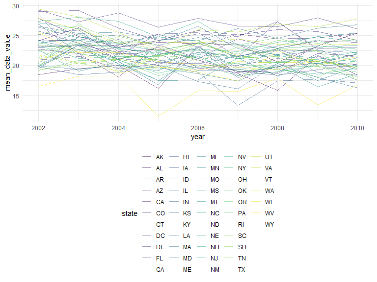
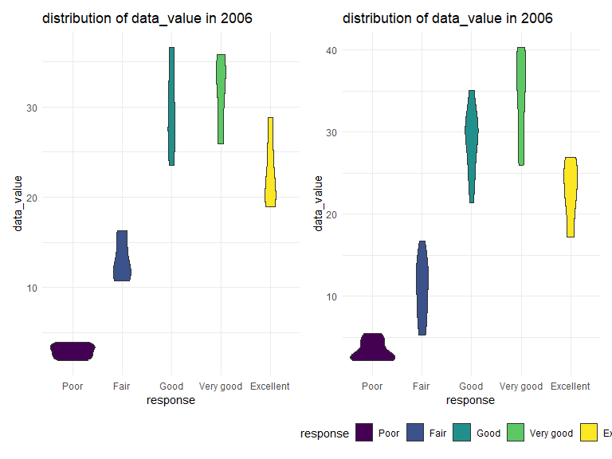
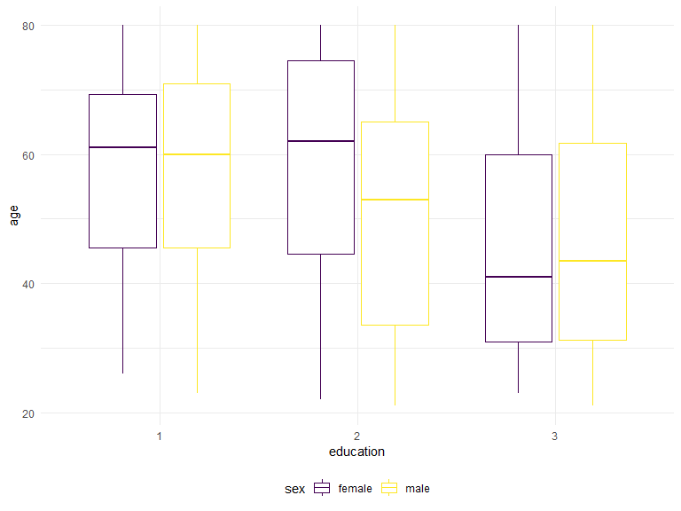

Untitled
================
Xiangxiong Feng
2023-10-14

# Problem 1

``` r
data("instacart")
instacart = 
  instacart |> 
  as_tibble()
```

``` r
instacart |> 
  count(aisle) |> 
  arrange(desc(n))
```

    ## # A tibble: 134 × 2
    ##    aisle                              n
    ##    <chr>                          <int>
    ##  1 fresh vegetables              150609
    ##  2 fresh fruits                  150473
    ##  3 packaged vegetables fruits     78493
    ##  4 yogurt                         55240
    ##  5 packaged cheese                41699
    ##  6 water seltzer sparkling water  36617
    ##  7 milk                           32644
    ##  8 chips pretzels                 31269
    ##  9 soy lactosefree                26240
    ## 10 bread                          23635
    ## # ℹ 124 more rows

``` r
instacart |> 
  count(aisle) |> 
  filter(n > 10000) |> 
  mutate(aisle = fct_reorder(aisle, n)) |> 
  ggplot(aes(x = aisle, y = n)) + 
  geom_point() + 
  labs(title = "Number of items ordered in each aisle") +
  theme(axis.text.x = element_text(angle = 60, hjust = 1))
```


``` r
instacart |> 
  filter(aisle %in% c("baking ingredients", "dog food care", "packaged vegetables fruits")) |>
  group_by(aisle) |> 
  count(product_name) |> 
  mutate(rank = min_rank(desc(n))) |> 
  filter(rank < 4) |> 
  arrange(desc(n)) |>
  knitr::kable()
```

| aisle                      | product_name                                  |    n | rank |
|:---------------------------|:----------------------------------------------|-----:|-----:|
| packaged vegetables fruits | Organic Baby Spinach                          | 9784 |    1 |
| packaged vegetables fruits | Organic Raspberries                           | 5546 |    2 |
| packaged vegetables fruits | Organic Blueberries                           | 4966 |    3 |
| baking ingredients         | Light Brown Sugar                             |  499 |    1 |
| baking ingredients         | Pure Baking Soda                              |  387 |    2 |
| baking ingredients         | Cane Sugar                                    |  336 |    3 |
| dog food care              | Snack Sticks Chicken & Rice Recipe Dog Treats |   30 |    1 |
| dog food care              | Organix Chicken & Brown Rice Recipe           |   28 |    2 |
| dog food care              | Small Dog Biscuits                            |   26 |    3 |

``` r
instacart |>
  filter(product_name %in% c("Pink Lady Apples", "Coffee Ice Cream")) |>
  group_by(product_name, order_dow) |>
  summarize(mean_hour = mean(order_hour_of_day)) |>
  pivot_wider(
    names_from = order_dow, 
    values_from = mean_hour) |>
  knitr::kable(digits = 2)
```

    ## `summarise()` has grouped output by 'product_name'. You can override using the
    ## `.groups` argument.

| product_name     |     0 |     1 |     2 |     3 |     4 |     5 |     6 |
|:-----------------|------:|------:|------:|------:|------:|------:|------:|
| Coffee Ice Cream | 13.77 | 14.32 | 15.38 | 15.32 | 15.22 | 12.26 | 13.83 |
| Pink Lady Apples | 13.44 | 11.36 | 11.70 | 14.25 | 11.55 | 12.78 | 11.94 |

## Problem 2

``` r
data("brfss_smart2010")
```

# data cleaning

``` r
brfss_smart2010 =
  brfss_smart2010 |>
  janitor::clean_names() |>
  filter(topic == 'Overall Health',
         response %in% c('Excellent', "Very good", "Good", "Fair", "Poor")) |>
  mutate(response = factor(response, 
                           levels = c("Poor", "Fair", "Good",
                                                "Very good","Excellent"), 
                           ordered = TRUE))|>
  rename(state = locationabbr, location = locationdesc)
```

# Question 1

``` r
#count which states were observed at 7 or more locations in 2002
brfss_smart2010_2002 = 
  brfss_smart2010 |>
  filter(year==2002)|>
  group_by(state, location)|>
  summarize(n_obs = n())|>
  count(state)|>
  filter(n>=7) 
```

    ## `summarise()` has grouped output by 'state'. You can override using the
    ## `.groups` argument.

``` r
Morethanseven_2002 = as.list(brfss_smart2010_2002$state)

#count which states were observed at 7 or more locations in 2002
brfss_smart2010_2010 = 
  brfss_smart2010 |>
  filter(year==2010)|>
  group_by(state, location)|>
  summarize(n_obs = n())|>
  count(state)|>
  filter(n>=7) 
```

    ## `summarise()` has grouped output by 'state'. You can override using the
    ## `.groups` argument.

``` r
Morethanseven_2010 = as.list(brfss_smart2010_2010$state)
```

In 2002, CT, FL, MA, NC, NJ, PA were observed at 7 or more locations. In
2010, CA, CO, FL, MA, MD, NC, NE, NJ, NY, OH, PA, SC, TX, WA were
observed at 7 or more locations.

# Question 2

``` r
Excellent_brfss = 
  brfss_smart2010|>
  filter(response == 'Excellent')|>
  select(year, state, data_value)|>
  group_by(year, state) |>
  summarize(
    mean_data_value = mean(data_value)
  )
```

    ## `summarise()` has grouped output by 'year'. You can override using the
    ## `.groups` argument.

``` r
Excellent_brfss |>
  ggplot(aes(x=year, y = mean_data_value)) +
  geom_line(aes(color = state), alpha = .5)
```



# Quesiton 3

``` r
plot_data_2006 = 
  brfss_smart2010 |>
  filter(year == 2006, state == 'NY') 
  
plot_2006 = 
  plot_data_2006|>
  ggplot(aes(x=response, y = data_value)) +
  ggtitle('distribution of data_value in 2006')+
  geom_violin(aes(fill = response))+
  theme(legend.position = 'none')
  

plot_data_2010 = 
  brfss_smart2010 |>
  filter(year == 2010, state == 'NY') 
  
plot_2010 = 
  plot_data_2010|>
  ggplot(aes(x=response, y = data_value)) +
  ggtitle('distribution of data_value in 2006')+
  geom_violin(aes(fill = response))


plot_2006+plot_2010
```



## Problem 3

``` r
accel_df =
  read_csv('data/nhanes_accel.csv')|>
  janitor::clean_names()|>
  drop_na()
```

    ## Rows: 250 Columns: 1441
    ## ── Column specification ────────────────────────────────────────────────────────
    ## Delimiter: ","
    ## dbl (1441): SEQN, min1, min2, min3, min4, min5, min6, min7, min8, min9, min1...
    ## 
    ## ℹ Use `spec()` to retrieve the full column specification for this data.
    ## ℹ Specify the column types or set `show_col_types = FALSE` to quiet this message.

``` r
tidy_accel_df = 
  pivot_longer(
    accel_df,
    min1:min1440,
    names_to = 'MIN',
    values_to = 'MIMS'
  )
```

``` r
demog_df =
  read_csv('data/nhanes_covar.csv')|>
  janitor::clean_names()|>
  drop_na()|>
  filter(age>= 21)|>
  mutate(education = factor(education, 
                           levels = c("1", "2", "3"), 
                           ordered = TRUE))
```

    ## Rows: 250 Columns: 5
    ## ── Column specification ────────────────────────────────────────────────────────
    ## Delimiter: ","
    ## dbl (5): SEQN, sex, age, BMI, education
    ## 
    ## ℹ Use `spec()` to retrieve the full column specification for this data.
    ## ℹ Specify the column types or set `show_col_types = FALSE` to quiet this message.

``` r
results_data_tidy = 
  full_join(demog_df, tidy_accel_df, by='seqn')|>
  drop_na()|>
   mutate(
     sex = 
      case_match(
        sex, 
        1 ~ "male", 
        2 ~ "female"))

results_data_untidy = 
  full_join(demog_df, accel_df, by='seqn')|>
  drop_na()|>
   mutate(
     sex = 
      case_match(
        sex, 
        1 ~ "male", 
        2 ~ "female"))
```

# Table fir number of men and women in each education category

``` r
results_data_untidy |>
  select(sex, education)|>
  group_by(education)|>
  count(education, sex)|>
  knitr::kable()
```

| education | sex    |   n |
|:----------|:-------|----:|
| 1         | female |  28 |
| 1         | male   |  27 |
| 2         | female |  23 |
| 2         | male   |  35 |
| 3         | female |  59 |
| 3         | male   |  56 |

The table is showing the number of men and women in each education
category. We can see that numbers of men and women are close in 1 and 3
education level but a relatively large diffierence in education 2 level.

# visualization of the age distributions for men and women in each education category. Comment on these items

``` r
results_data_untidy |>
  ggplot(aes(x=education, y = age)) +
  geom_boxplot(aes(color = sex))
```



This is a boxplot showing the age distributions for men and women in
each education category. From the plot, we can see that the biggest
difference occurs in education level 2.

# Plot total activities (y-axis) against age (x-axis)

``` r
total_act_df =
  results_data_untidy
```
